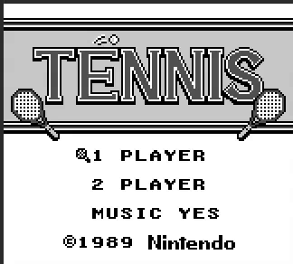
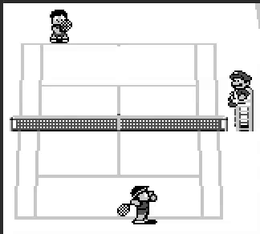

# PixelBoy

 


### Keyboard mapping

| Gameboy   | PC        |
| ------------  | ------------   |
| A         | C         | 
| B         | V         | 
| Select    | Space     |
| Start     | Enter     |
| Right     | A Key     |
| Left      | D Key     |
| Up        | W Key     |
| Down      | S Key     |


### Running 

Build and run using
```sh
  make release
```

### Built With

* 
* 


## Acknowledgments

* [Opcodes Table](https://gbdev.io/gb-opcodes/optables/)
* [CPU opcodes reference](https://rgbds.gbdev.io/docs/v0.9.2/gbz80.7#LD__n16_,SP)

* [Pandocs](https://gbdev.io/pandocs/Specifications.html)
* [Gameboy Manual](http://marc.rawer.de/Gameboy/Docs/GBCPUman.pdf)
* [RayLib Cheatsheet](https://www.raylib.com/cheatsheet/cheatsheet.html)


